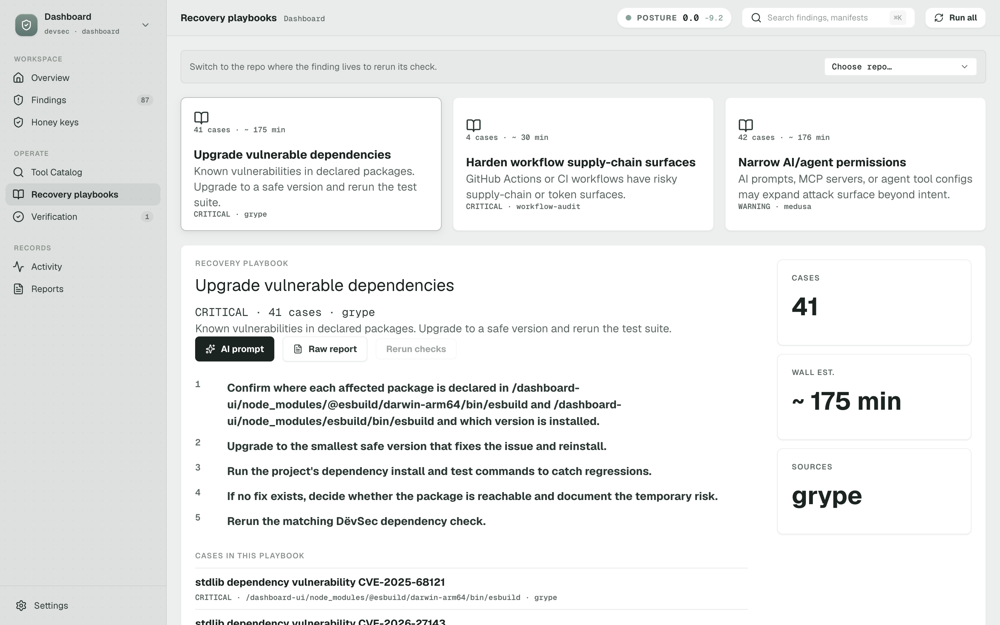
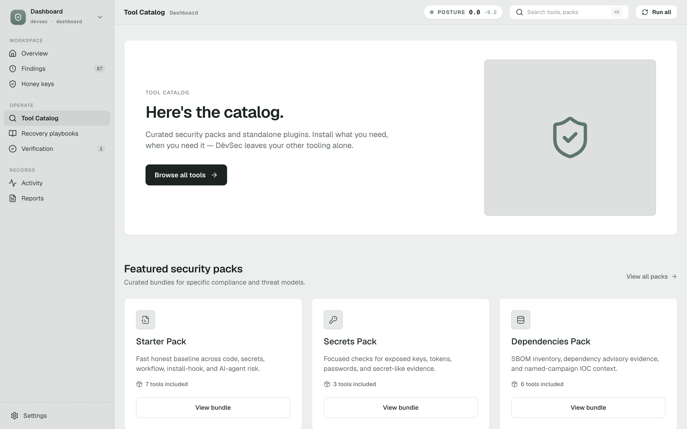
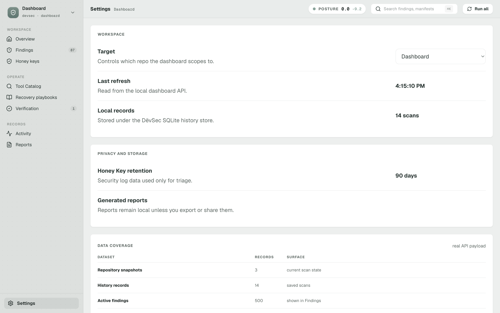

# DëvSec — local-first security observability

A practical security sweep for repos you actually work in. DëvSec runs established open-source scanners on your machine, stores the history in local SQLite, and turns scanner noise into a small set of plain next actions.

*(Installed as the `security-observatory` Python package. The CLI is `security-scan`. The dashboard is branded DëvSec — same project, three names you'll meet in different places.)*

**Status:** 0.1.x — early. Local scanning works well; the dashboard is honest about what's still partial.

<video src="design/trailer/trailer.mp4" controls width="100%" poster="design/screenshots/01-overview.png">
  Your browser does not support embedded video. <a href="design/trailer/trailer.mp4">Download the 47-second trailer (5.7 MB).</a>
</video>

*The dashboard groups raw scanner output into action-level cases — each carries plain-English risk, severity, and an agent-ready handoff prompt. The 0.0 / 10 posture is real: this is DëvSec scanning itself.*

## Why this exists

Most security platforms send your source code to a SaaS, charge per repo, or both.
DëvSec is the opposite shape: scanners run locally against a clone of the repo you already have.
Results stay under `~/.security-observatory`, nothing is uploaded, and no cloud LLM is required.
The dashboard exists so you can read what the scanners actually found without grepping raw JSON.

For the longer-form argument behind the local-first stance, see [PROVOCATION.md](PROVOCATION.md).

## What It Is

- A local CLI: `security-scan`
- A local dashboard: `security-scan dashboard`
- A local SQLite history store under `~/.security-observatory`
- A scanner orchestration layer around established open-source tools
- A normalizer that converts scanner output into one consistent finding shape
- A case builder that groups raw findings into human-readable remediation cases
- A honeytoken system for defensive decoy secrets called Honey Keys

## What It Is Not

- Not a hosted security platform
- Not a cloud AI scanner
- Not a replacement for manual review, threat modeling, or production monitoring
- Not proof that a repository is safe when scans come back clean
- Not dependent on paid APIs, token-based analysis, or hidden SaaS services

## Screens



*Cases roll up into category-level playbooks — 41 stdlib CVE findings become one "Upgrade vulnerable dependencies" playbook with steps, a wall-clock estimate, and an AI-prompt handoff, not 41 separate tickets.*



*Every scanner is named with install state (built-in, detected-locally, managed-install, coming soon) and a per-tool policy that gates network access, credentials, and file writes — the catalog is the contract; nothing runs that hasn't been approved in it.*



*Repository snapshots, history records, and active findings are stored in local SQLite under `~/.security-observatory`; the Settings page shows you what the dashboard has on hand and reinforces that reports never leave the machine unless you export them.*

## Current Features

### Tool Catalog and Security Packs

DëvSec has a read-only Tool Catalog contract that explains what each scanner/tool does, whether it is built in, detected locally, DëvSec-managed, unavailable, or only coming soon, and which safety policy applies before any action can run.

Security Packs are curated groups of catalog entries for a job, such as Starter, Secrets, Dependencies, and AI Agent. A pack never weakens a tool's policy: network access, credentials, file writes, destructive actions, and Agent Lab availability come from enforceable catalog fields, not from friendly card copy.

Docker is optional, not the foundation. External Surface coverage is a Coming Soon placeholder in the MVP and is display-only: no target input, probing, active recon, install action, run action, or agent-triggered external scan.

See [docs/tool-catalog.md](docs/tool-catalog.md).

### Local Repository Scanning

Security Observatory can scan one repository, every discovered repository under a development root, or a selected repo from the dashboard.

Current scan areas:

| Area | Current coverage |
| --- | --- |
| Code security | Semgrep with local rules |
| Secrets | Gitleaks, TruffleHog, Trivy secret scanning |
| Dependencies | Trivy, OSV-Scanner, Grype |
| SBOM | Syft CycloneDX output |
| Filesystem and containers | Trivy and Grype filesystem scanning |
| Infrastructure as code | Trivy misconfiguration checks and Checkov |
| AI-agent and MCP risk | Built-in deterministic checks plus Medusa |

Scanner failures are isolated. If a scanner is missing, times out, or returns incomplete output, the scan is marked partial and the rest of the evidence is still saved.

### Scan Profiles

| Profile | Command | Purpose |
| --- | --- | --- |
| Default | `security-scan .` | Balanced local scan across the main scanner set |
| Quick | `security-scan --quick` | Fast baseline for obvious code, secret, dependency, and AI-agent risks |
| Code | `security-scan --code` | Code vulnerability checks |
| AI | `security-scan --ai` | Agent instructions, MCP config, editor config, and repo-poisoning checks |
| Dependencies | `security-scan --deps` | Dependency vulnerabilities and SBOM generation |
| Trust | `security-scan --trust` | Optional network-backed OpenSSF Scorecard and Criticality enrichment for SBOM components |
| Trust cache only | `security-scan --trust-cache-only` | Attach previously cached dependency trust data without network access |
| Platform posture | `security-scan --platform-posture` | Optional connected legitify check for SCM branch protection, workflow permissions, webhooks, and platform settings |
| Secrets | `security-scan --secrets` | Secret detection with multiple scanners |
| IaC | `security-scan --iac` | Cloud and infrastructure configuration checks |
| Full | `security-scan --full` | Deepest configured local scan; connected token-backed checks still require explicit opt-in |

Profiles can be combined, such as `security-scan --secrets --deps` or `security-scan --deps --trust`.

### Normalized Reports

Every scan saves:

- Raw scanner output, sanitized where possible
- A normalized `normalized-report.json`
- Scanner availability and error status
- Severity and category counts
- Evidence gaps from missing or incomplete tools
- A repo health score from 0 to 100
- Human-readable security cases with fix guidance

Findings are deduplicated by stable fingerprints so repeated scanner evidence does not inflate the result.

### Security Cases

The app groups raw findings into cases that are easier to act on than scanner dumps.

Each case includes:

- Plain-English risk
- Severity and category
- Action level: `fix_now`, `verify`, `watch`, or `info`
- Confidence level
- Affected files
- Scanner evidence
- Suggested fix steps
- An agent-ready follow-up prompt

The dashboard also tracks whether cases are new, recurring, or resolved compared with the previous scan.

### Dashboard

The dashboard is a React/Vite app served by the Python CLI. It runs locally on `127.0.0.1`.

Current dashboard views:

- Overview: top risks, best next action, scan coverage, and health movement
- What Needs Attention: searchable and filterable cases
- Honey Keys: create, insert, archive, and investigate decoy secrets
- Code: code-security findings
- Dependencies: package and vulnerability findings
- Infrastructure: IaC and cloud-configuration findings
- MCP: AI-agent, MCP, and editor-configuration findings

From the dashboard you can:

- Select a repository target
- Add a custom repo path
- Run quick, category-specific, or full checks
- Watch scan progress by scanner
- Download a full JSON report
- Download an AI handoff prompt for follow-up work
- Mark cases as verified, false positive, accepted risk, or fixed

### Honey Keys

Honey Keys are powerless decoy secrets that act as tripwires. They cannot authenticate to any real system, but they alert you when touched.

Current Honey Key support:

- Create decoy keys for a selected repo
- Copy generated snippets for realistic decoy files
- Insert decoys safely under `.devsec/honeykeys/` by default
- Allow advanced placement only with explicit confirmation
- Refuse to overwrite existing files
- Refuse to write outside the selected repo
- Store only a secure hash of the raw key after creation
- Record trigger events with redacted request metadata
- Turn the affected project critical when a key is triggered
- Archive keys after investigation

See [docs/honey-keys.md](docs/honey-keys.md) for operating guidance.

### Local Reports and AI Handoff

Each scan can be opened as:

- A full normalized JSON report
- A local HTML report page
- A Markdown prompt for an AI coding agent

The AI handoff prompt is generated locally from saved cases and findings. It asks the agent to verify findings before fixing them and includes guardrails for secrets, dependency upgrades, and destructive actions.

### Optional Desktop Launcher

The repo includes an optional macOS desktop app wrapper for launching the local dashboard with its own Dock icon.

See [docs/desktop-launcher.md](docs/desktop-launcher.md).

### Optional CI Template

A starter GitHub Actions workflow is available at [templates/security.yml](templates/security.yml). CI support is optional; the primary workflow is local scanning.

## Try it

No hosted demo URL — by design. DëvSec runs on your machine, and any demo we'd host would either require you to upload code (the whole point we're not doing), or show synthetic data that wouldn't prove anything real.

The shortest path to seeing DëvSec work is:

```bash
git clone https://github.com/Christian-Katzmann/dev-security.git
cd dev-security
./install-security-observatory.sh
security-scan .
security-scan dashboard
```

A clone, an installer, a scan of this repo, and the local dashboard at `http://127.0.0.1:8765`. The first scan takes roughly two minutes on a recent Mac.

If you want to see the dashboard with the same demo data the [Screens](#screens) section uses, run the scan against this repo specifically — those screenshots are DëvSec scanning itself.

## Installation

Requirements:

- macOS preferred
- Homebrew
- Python 3.11+
- `uv` for Python CLI tools
- Node.js/npm if rebuilding the dashboard

Install the CLI, scanner tools, local folders, and dashboard assets:

```bash
./install-security-observatory.sh
```

The installer is idempotent. It prefers Homebrew for compiled scanners and `uv tool` for Python CLIs such as Checkov and Medusa.

The CLI wrapper is installed to:

```text
~/.local/bin/security-scan
```

If your shell cannot find it, add this to your shell profile:

```bash
export PATH="$HOME/.local/bin:$PATH"
```

## Usage

Scan the current repository:

```bash
security-scan .
```

Scan another repository:

```bash
security-scan ~/Dev/myrepo
```

Scan discovered repositories under `~/Dev`:

```bash
security-scan --all-repos
```

Limit discovery to a different root:

```bash
security-scan --all-repos --dev-root ~/Dev/Projects
```

Run a quick scan:

```bash
security-scan --quick
```

Run a full scan:

```bash
security-scan --full
```

Opt into dependency trust enrichment:

```bash
security-scan --deps --trust
```

Use cached dependency trust data without network access:

```bash
security-scan --deps --trust-cache-only
```

Check the current repo against the built-in named-campaign IOC starter pack:

```bash
security-scan ioc .
```

Sweep saved SBOM evidence across discovered repos with a custom IOC pack:

```bash
security-scan ioc --all-repos --dev-root ~/Dev/Projects --feed ~/Dev/ioc-packs/current-campaign.yaml
```

Opt into connected platform posture checks:

```bash
SCM_TOKEN=<github-or-gitlab-token> security-scan --platform-posture
```

Platform posture is deliberately outside default, quick, local, and full scans. It asks legitify to inspect SCM settings for the resolved repository target, then stores only sanitized posture state and findings locally. If legitify, credentials, or a repository target are missing, the scan is saved as partial/skipped instead of failing the whole run.

Fail non-zero when a severity threshold is reached:

```bash
security-scan . --fail-on high
```

Print a JSON summary to stdout:

```bash
security-scan . --json
```

Open the local dashboard:

```bash
security-scan dashboard
```

Use a custom dashboard port:

```bash
security-scan dashboard --port 8766
```

Check installed scanner tools:

```bash
security-scan doctor
```

Print the GitHub Actions template:

```bash
security-scan template
```

Print local scheduling guidance:

```bash
security-scan schedule
```

## Local Data

All scan data is stored locally by default:

```text
~/.security-observatory/
  reports/
  db/
  cache/
  repos/
  logs/
```

You can override the home directory with:

```bash
SECURITY_OBSERVATORY_HOME=/path/to/store security-scan .
```

The dashboard discovers projects from `~/Dev/Projects` by default. Override that with:

```bash
SECURITY_OBSERVATORY_PROJECTS_ROOT=/path/to/projects security-scan dashboard
```

## Privacy and Safety Defaults

- Reports stay on the local machine.
- The dashboard is bound to `127.0.0.1`.
- No cloud LLM calls are required.
- OpenSSF Scorecard and Criticality lookups run only when `--trust` is used.
- Cached trust data is stored under `~/.security-observatory/cache/dependency-trust/` and can be reused offline with `--trust-cache-only`.
- Semgrep metrics and version checks are disabled for local scans.
- Secret-looking values are redacted before normalized reports are written.
- Honey Key trigger metadata is redacted and body capture is summarized.
- Generated and runtime folders are excluded by default.

Default scan exclusions include:

```text
.git, .claude, .codex, .vercel, .turbo, .cache, node_modules, dist, build,
.next, out, coverage, venv, .venv, vendor, target, tmp, temp, logs,
__generated__
```

## Health Score

The engine computes a health score from 0 to 100 internally. The CLI prints it and the JSON report (`security-scan . --json`) emits it on that 0–100 scale. The dashboard divides the same value by 10 and displays it as `/ 10` (so a 33 in the JSON shows as `3.3 / 10`). The table below uses the dashboard's 0–10 scale.

Health scores start at 10.0 and subtract weighted risk:

| Finding type | Penalty (display scale) |
| --- | ---: |
| Leaked secret | -4.0, capped at -8.0 |
| Critical vulnerability | -2.5 |
| AI-agent or repo-poisoning risk | -1.5, capped at -4.5 |
| High vulnerability | -1.0, capped at -6.0 |
| Medium vulnerability | -0.2, capped at -2.5 |
| Low vulnerability | -0.05, capped at -1.0 |
| Missing SBOM | -0.3 |

The final score is capped between 0.0 and 10.0 on display (0 and 100 internally).

## Development

Install dashboard dependencies:

```bash
make dashboard-install
```

Build dashboard assets served by the Python CLI:

```bash
make dashboard-build
```

Run the dashboard UI development server:

```bash
make dashboard-dev
```

Build and install the optional macOS desktop launcher:

```bash
make desktop-build
make desktop-install
```

Stop the desktop launcher server:

```bash
make desktop-quit
```

Run tests:

```bash
uv run pytest
```

## Project Structure

```text
src/security_observatory/       Python CLI, scanners, storage, dashboard server
src/security_observatory/rules/ Local scanner rules
dashboard-ui/                   React/Vite dashboard source
src/security_observatory/dashboard/ Built dashboard assets served by the CLI
docs/                           Detailed operating docs
templates/                      Optional CI workflow template
tests/                          Python test suite
scripts/                        Dashboard and desktop launcher scripts
```

## Documentation

- [Setup guide](docs/setup.md)
- [Architecture](docs/architecture.md)
- [Glossary](docs/glossary.md) — finding, case, action level, confidence, honey key, evidence gap
- [Architectural decisions](docs/decisions/) — accepted ADRs and a `REJECTED/` folder for paths considered and turned down
- [Tool Catalog and Security Packs](docs/tool-catalog.md)
- [Current scanner catalog mapping](docs/tool-catalog-current-scanners.md)
- [Scanner explanations](docs/scanners.md)
- [IOC packs](docs/iocs.md)
- [Adding scanners](docs/adding-scanners.md)
- [Honey Keys](docs/honey-keys.md)
- [False positives](docs/false-positives.md)
- [Troubleshooting](docs/troubleshooting.md)
- [Desktop launcher](docs/desktop-launcher.md)
- [Incident log](docs/incidents/) — point-in-time IOC sweeps and lessons-for-product notes

## Operational Notes

- Treat scanner output as evidence, not truth. Verify before changing code.
- A partial scan is still useful, but the missing tools limit what the app can prove.
- Secret findings should be handled carefully: rotate first, then clean code or history.
- Honey Keys alert when touched; they do not block access or identify the person behind a request.
- Full scans can be slow on large repositories. Start with `--quick` when you want a fast baseline.
